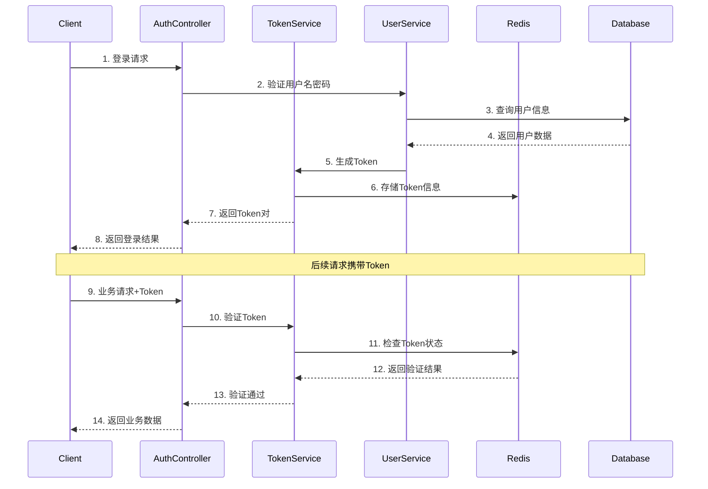

# RBAC系统认证登录模块分析

## 一、认证体系架构

### 1.1 核心组件
```java
// 1. Token服务
@Service
public class TokenServiceImpl implements TokenService {
    @Autowired
    private RedisTemplate<String, Object> redisTemplate;
    @Autowired
    private DistributedLockService lockService;
    @Autowired
    private LoginInfoService loginInfoService;
    @Autowired
    private SysUserService userService;
}

// 2. 登录信息服务
@Service
public class LoginInfoServiceImpl implements LoginInfoService {
    @Autowired
    private LoginInfoMapper loginInfoMapper;
    @Autowired
    private HttpServletRequest request;
}

// 3. 认证拦截器
@Component
public class AuthInterceptor implements HandlerInterceptor {
    private static final List<String> WHITE_LIST = Arrays.asList(
        "/auth/login",
        "/auth/logout",
        "/auth/refresh"
        // ...其他白名单路径
    );
}
```

### 1.2 存储结构
```sql
-- 登录信息表
CREATE TABLE sys_login_info (
    id BIGINT PRIMARY KEY AUTO_INCREMENT,
    user_id BIGINT NOT NULL,
    username VARCHAR(50) NOT NULL,
    login_id VARCHAR(50) NOT NULL,
    device_type VARCHAR(20),
    device_info VARCHAR(200),
    browser VARCHAR(50),
    os VARCHAR(50),
    login_ip VARCHAR(50),
    login_location VARCHAR(100),
    login_time DATETIME NOT NULL,
    logout_time DATETIME,
    login_status TINYINT,
    fail_reason VARCHAR(200)
    -- ...其他字段
);
```

### 1.3 缓存设计
```java
// Redis Key设计
private static final String TOKEN_PREFIX = "token:";           // 访问令牌
private static final String REFRESH_TOKEN_PREFIX = "token:refresh:"; // 刷新令牌
private static final String TOKEN_BLACKLIST_PREFIX = "token:blacklist:"; // 黑名单
private static final String USER_SESSIONS_PREFIX = "login:sessions:";    // 用户会话
```

## 二、认证流程详解

### 2.1 登录认证流程
```java
public TokenPair generateTokenPair(Long userId) {
    try {
        // 1. 生成登录标识
        String loginId = UUID.randomUUID().toString();
        
        // 2. 记录登录信息
        UserVO user = userService.findById(userId);
        loginInfoService.recordLoginInfo(userId, user.getUsername(), loginId, true, null);
        
        // 3. 会话数量控制
        String sessionsKey = USER_SESSIONS_PREFIX + userId;
        Long sessionCount = redisTemplate.opsForSet().size(sessionsKey);
        if (sessionCount != null && sessionCount >= maxSessions) {
            if (!kickOut) {
                throw new BusinessException(ResponseCode.ERROR, "已达到最大会话数限制");
            }
            // 踢出旧会话
            kickOutOldSession(sessionsKey);
        }
        
        // 4. 生成Token对
        Map<String, Object> claims = new HashMap<>();
        claims.put("userId", userId);
        claims.put("loginId", loginId);
        String token = JwtUtil.generateJwt(claims);
        String refreshToken = JwtUtil.generateRefreshToken(claims, refreshExpireTime);
        
        // 5. 保存会话信息
        saveSessionInfo(userId, token, refreshToken, sessionsKey);
        
        return new TokenPair(token, refreshToken);
    } catch (Exception e) {
        // 6. 异常处理
        handleLoginFailure(userId, e);
        throw e;
    }
}
```

### 2.2 Token验证流程
```java
public boolean validateToken(String token) {
    if (token == null) return false;
    
    try {
        // 1. 处理Bearer前缀
        final String tokenToValidate = removeBearerPrefix(token);
        
        // 2. 基本有效性验证
        if (!JwtUtil.validateToken(tokenToValidate)) {
            log.warn("Token基本验证失败");
            return false;
        }
        
        // 3. 黑名单检查
        if (isTokenBlacklisted(tokenToValidate)) {
            log.warn("Token已被加入黑名单");
            return false;
        }
        
        // 4. Redis存储验证
        Claims claims = JwtUtil.parseJwt(tokenToValidate);
        Long userId = Long.valueOf(claims.getSubject());
        String storedToken = getStoredToken(userId);
        
        // 5. Token一致性检查
        return validateTokenConsistency(tokenToValidate, storedToken);
    } catch (Exception e) {
        log.error("Token验证失败: {}", e.getMessage());
        return false;
    }
}
```

### 2.3 登出流程
```java
public void removeToken(Long userId) {
    try {
        // 1. 记录登出信息
        recordLogout(userId);
        
        // 2. 清理会话信息
        String sessionsKey = USER_SESSIONS_PREFIX + userId;
        Set<Object> sessionsObj = redisTemplate.opsForSet().members(sessionsKey);
        Set<String> sessions = convertToStringSet(sessionsObj);
        
        // 3. 加入黑名单
        invalidateTokens(sessions);
        
        // 4. 清理Redis数据
        cleanupRedisData(userId, sessionsKey);
        
        log.info("用户token移除完成 - userId: {}", userId);
    } catch (Exception e) {
        log.error("移除Token失败: {}", e.getMessage());
        throw e;
    }
}
```

## 三、安全机制

### 3.1 会话安全
```java
// 1. 会话数量控制
@Value("${rbac.security.session.max-sessions:1}")
private int maxSessions;

// 2. 会话踢出策略
@Value("${rbac.security.session.kick-out:true}")
private boolean kickOut;

// 3. Token有效期控制
@Value("${rbac.jwt.expire-time}")
private long expireTime;

// 4. 刷新Token有效期
@Value("${rbac.jwt.refresh-expire-time:86400000}")
private long refreshExpireTime;
```

### 3.2 并发控制
```java
// 1. 分布式锁保护
String lockKey = "refresh:" + finalRefreshToken;
return lockService.executeWithLock(lockKey, 10L, () -> {
    // Token刷新逻辑
});

// 2. 原子操作
boolean added = Boolean.TRUE.equals(
    redisTemplate.opsForValue().setIfAbsent(blacklistKey, "1", remainingTime, TimeUnit.MILLISECONDS)
);
```

### 3.3 异常处理
```java
try {
    // 业务逻辑
} catch (BusinessException e) {
    throw e;
} catch (Exception e) {
    log.error("操作失败: {}", e.getMessage());
    throw new BusinessException(ResponseCode.SYSTEM_ERROR, "系统错误");
}
```

## 四、日志审计

### 4.1 登录日志记录
```java
@Async
public void recordLoginInfo(Long userId, String username, String loginId, 
                          boolean success, String failReason) {
    try {
        LoginInfo info = new LoginInfo();
        info.setUserId(userId);
        info.setUsername(username);
        info.setLoginId(loginId);
        info.setLoginIp(IpUtil.getIpAddress(request));
        info.setLoginTime(LocalDateTime.now());
        info.setLoginStatus(success ? 1 : 0);
        info.setFailReason(failReason);
        
        loginInfoMapper.insert(info);
    } catch (Exception e) {
        log.error("记录登录信息失败: {}", e.getMessage());
    }
}
```

### 4.2 日志清理机制
```java
@Scheduled(cron = "0 0 2 * * ?")
@Transactional(rollbackFor = Exception.class)
public void cleanExpiredLogs(int days) {
    try {
        LocalDateTime time = LocalDateTime.now().minusDays(days);
        int count = loginInfoMapper.deleteBeforeTime(time);
        log.info("清理{}天前的登录日志{}条", days, count);
    } catch (Exception e) {
        log.error("清理过期登录日志失败: {}", e.getMessage());
    }
}
```

## 五、待优化建议

### 5.1 安全增强
```java
// 1. 添加IP地址变化检测
private boolean checkIpChange(String loginIp, String storedIp) {
    return !loginIp.equals(storedIp);
}

// 2. 增加设备指纹识别
private String generateDeviceFingerprint(HttpServletRequest request) {
    // 基于User-Agent、IP等信息生成设备指纹
}

// 3. 实现登录风险评估
private int assessLoginRisk(LoginInfo loginInfo) {
    // 基于登录时间、地点、设备等因素评估风险
}
```

### 5.2 性能优化
```java
// 1. 批量处理优化
private void batchInvalidateTokens(List<String> tokens) {
    // 批量加入黑名单
}

// 2. 缓存预热
private void preloadUserSessions(Long userId) {
    // 预加载用户会话信息
}

// 3. 异步处理优化
@Async
private void asyncCleanupExpiredData() {
    // 异步清理过期数据
}
```

### 5.3 功能扩展
```java
// 1. 多因素认证支持
private boolean requireMFA(UserVO user, LoginContext context) {
    // 判断是否需要多因素认证
}

// 2. 登录行为分析
private void analyzeLoginBehavior(LoginInfo loginInfo) {
    // 分析用户登录行为模式
}

// 3. 安全预警机制
private void checkSecurityAlert(LoginInfo loginInfo) {
    // 检查是否需要触发安全预警
}
```

## 六、总结

认证登录模块采用了JWT + Redis的混合认证方案，实现了完整的登录、登出、Token刷新等功能。通过会话控制、并发控制、日志审计等机制保证了系统的安全性和可靠性。未来可以在安全性、性能和功能特性等方面进行进一步的优化和扩展。

## 七、认证策略配置

### 7.1 配置项说明
```yaml
rbac:
  jwt:
    # JWT配置
    secret-key: your-secret-key
    expire-time: 43200000        # 12小时
    refresh-expire-time: 86400000 # 24小时
    token:
      blacklist-size: 10000
    ip-check:
      enabled: true
      action: WARN  # WARN/REJECT
  
  security:
    session:
      # 会话控制
      max-sessions: 1
      kick-out: true
    password:
      # 密码策略
      min-length: 8
      max-length: 20
      require-number: true
      require-letter: true
      require-special: false
    login:
      # 登录限制
      retry-limit: 5
      lock-time: 30
      verify-code: true
```

### 7.2 密码加密方案
```java
@Component
public class PasswordEncoder {
    // 加密算法
    private static final String ALGORITHM = "PBKDF2WithHmacSHA256";
    // 迭代次数
    private static final int ITERATIONS = 10000;
    // 密钥长度
    private static final int KEY_LENGTH = 256;
    
    public String encode(String password, String salt) {
        // PBKDF2加密实现
    }
    
    public boolean matches(String rawPassword, String encodedPassword) {
        // 密码验证逻辑
    }
}
```

## 八、前端交互流程

### 8.1 前端Token管理
```javascript
// axios请求拦截器
axios.interceptors.request.use(config => {
    const token = localStorage.getItem('token');
    if (token) {
        config.headers['Authorization'] = 'Bearer ' + token;
    }
    return config;
});

// axios响应拦截器
axios.interceptors.response.use(
    response => {
        return response;
    },
    error => {
        if (error.response.status === 401) {
            // Token过期处理
            const refreshToken = localStorage.getItem('refreshToken');
            if (refreshToken) {
                return refreshTokenAndRetry(error.config);
            } else {
                redirectToLogin();
            }
        }
        return Promise.reject(error);
    }
);
```

### 8.2 登录状态维护
```javascript
class AuthService {
    // 登录处理
    async login(username, password) {
        const response = await axios.post('/auth/login', {
            username,
            password
        });
        this.setTokens(response.data);
        return response;
    }
    
    // Token刷新
    async refreshToken() {
        const refreshToken = localStorage.getItem('refreshToken');
        const response = await axios.post('/auth/refresh', {
            refreshToken
        });
        this.setTokens(response.data);
        return response;
    }
    
    // 登出处理
    async logout() {
        await axios.post('/auth/logout');
        this.clearTokens();
    }
    
    // Token存储
    setTokens(data) {
        localStorage.setItem('token', data.token);
        localStorage.setItem('refreshToken', data.refreshToken);
    }
    
    // 清理Token
    clearTokens() {
        localStorage.removeItem('token');
        localStorage.removeItem('refreshToken');
    }
}
```

## 九、完整认证流程图



## 十、异常场景处理

### 10.1 登录异常处理
```java
@ExceptionHandler(LoginException.class)
public Result<String> handleLoginException(LoginException e) {
    // 1. 记录登录失败
    loginInfoService.recordLoginInfo(
        e.getUserId(), 
        e.getUsername(), 
        null, 
        false, 
        e.getMessage()
    );
    
    // 2. 检查失败次数
    int failCount = loginInfoService.countLoginFail(e.getUserId());
    if (failCount >= maxRetryCount) {
        // 3. 账号锁定
        userService.lockAccount(e.getUserId(), lockTime);
        return Result.error("账号已被锁定，请稍后再试");
    }
    
    return Result.error(e.getMessage());
}
```

### 10.2 Token异常处理
```java
@ExceptionHandler(TokenException.class)
public Result<String> handleTokenException(TokenException e) {
    switch (e.getType()) {
        case EXPIRED:
            return Result.error(401, "Token已过期");
        case INVALID:
            return Result.error(401, "无效的Token");
        case BLACKLISTED:
            return Result.error(401, "Token已被禁用");
        default:
            return Result.error(401, "Token验证失败");
    }
}
```

## 十一、安全最佳实践

### 11.1 密码安全
1. 使用PBKDF2等安全的密码哈希算法
2. 为每个用户生成唯一的盐值
3. 实施密码强度策略
4. 定期提醒用户更新密码

### 11.2 Token安全
1. 使用足够长的密钥
2. 设置合理的过期时间
3. 实现Token轮换机制
4. 维护Token黑名单

### 11.3 接口安全
1. 实施接口限流
2. 添加请求签名验证
3. 防止重放攻击
4. 记录安全审计日志

### 11.4 数据安全
1. 敏感信息加密存储
2. 传输数据使用HTTPS
3. 实施数据访问控制
4. 定期数据备份

## 十二、进阶优化建议

### 12.1 安全增强方案

#### 12.1.1 验证码机制
```java
public interface CaptchaService {
    // 图形验证码
    String generateImageCaptcha(String sessionId);
    
    // 短信验证码
    void sendSmsCaptcha(String phone);
    
    // 滑动验证码
    boolean validateSliderCaptcha(String sessionId, int offset);
}
```

#### 12.1.2 登录行为分析
```java
@Service
public class LoginBehaviorAnalyzer {
    // 异常时间检测
    public boolean isAbnormalLoginTime(LocalDateTime loginTime) {
        // 判断是否在异常时间段(如凌晨)登录
    }
    
    // 地理位置分析
    public boolean isLocationChanged(String lastLoginIp, String currentIp) {
        // 分析IP地址变化是否异常
    }
    
    // 设备指纹分析
    public boolean isDeviceChanged(String lastDeviceInfo, String currentDevice) {
        // 分析设备变化是否异常
    }
}
```

#### 12.1.3 多因素认证(MFA)
```java
public interface MFAService {
    // 生成MFA密钥
    String generateMFASecret(Long userId);
    
    // 验证MFA码
    boolean validateMFACode(Long userId, String code);
    
    // 获取MFA二维码
    String getMFAQRCode(Long userId, String secret);
}
```

### 12.2 性能优化方向

#### 12.2.1 Redis优化
```java
@Service
public class TokenCacheService {
    // 批量操作示例
    public void batchInvalidateTokens(List<String> tokens) {
        redisTemplate.executePipelined((RedisCallback<Object>) connection -> {
            for (String token : tokens) {
                connection.setEx(token.getBytes(), 
                               expireTime, 
                               "1".getBytes());
            }
            return null;
        });
    }
    
    // 缓存预热
    @PostConstruct
    public void preloadCache() {
        // 系统启动时预加载热点数据
    }
}
```

#### 12.2.2 数据库优化
```sql
-- 登录日志表分区
ALTER TABLE sys_login_info
PARTITION BY RANGE (TO_DAYS(login_time)) (
    PARTITION p_2024_01 VALUES LESS THAN (TO_DAYS('2024-02-01')),
    PARTITION p_2024_02 VALUES LESS THAN (TO_DAYS('2024-03-01')),
    PARTITION p_max VALUES LESS THAN MAXVALUE
);

-- 优化查询索引
CREATE INDEX idx_user_login_time 
ON sys_login_info (user_id, login_time);
```

### 12.3 用户体验提升

#### 12.3.1 记住登录状态
```java
public class RememberMeService {
    // 生成持久化Token
    public String generatePersistentToken(Long userId) {
        // 生成长期有效的Token
    }
    
    // 自动续期
    public void autoRenewToken(String token) {
        // Token即将过期时自动续期
    }
}
```

#### 12.3.2 登录状态反馈
```java
@Service
public class LoginNotificationService {
    // 发送登录通知
    public void sendLoginNotification(LoginInfo loginInfo) {
        if (isAbnormalLogin(loginInfo)) {
            // 发送异常登录通知
            notifyUser(loginInfo.getUserId(), 
                      "检测到异常登录",
                      buildNotificationContent(loginInfo));
        }
    }
}
```

### 12.4 运维监控增强

#### 12.4.1 监控指标
```java
@Component
public class LoginMetricsCollector {
    // 登录成功率统计
    private Counter loginSuccessCounter;
    private Counter loginFailureCounter;
    
    // 登录耗时监控
    private Summary loginLatency;
    
    // 并发登录量
    private Gauge concurrentLogins;
    
    @PostConstruct
    public void init() {
        // 初始化监控指标
    }
}
```

#### 12.4.2 告警配置
```yaml
alert:
  login:
    # 登录失败告警
    failure-threshold: 10  # 10分钟内失败次数
    failure-window: 600    # 统计窗口(秒)
    
    # 并发告警
    concurrent-threshold: 1000  # 并发登录阈值
    
    # 响应时间告警
    latency-threshold: 1000    # 响应时间阈值(ms)
```

### 12.5 架构优化建议

#### 12.5.1 认证中心化
```java
@Service
public class AuthenticationCenter {
    // OAuth2.0支持
    public OAuth2TokenResponse handleOAuth2Login(OAuth2LoginRequest request) {
        // OAuth2.0登录处理
    }
    
    // SSO支持
    public String generateSSOToken(Long userId, String clientId) {
        // 生成SSO Token
    }
}
```

#### 12.5.2 插件化认证
```java
public interface AuthenticationProvider {
    // 认证接口
    AuthResult authenticate(AuthContext context);
    
    // 是否支持该认证方式
    boolean supports(AuthenticationType type);
}

// 实现类示例
@Component
public class SmsAuthenticationProvider implements AuthenticationProvider {
    @Override
    public AuthResult authenticate(AuthContext context) {
        // 短信验证码认证实现
    }
    
    @Override
    public boolean supports(AuthenticationType type) {
        return AuthenticationType.SMS.equals(type);
    }
}
```

### 12.6 业务功能扩展

#### 12.6.1 登录策略
```java
@Service
public class LoginPolicyService {
    // 检查登录时间限制
    public boolean isLoginTimeAllowed(Long userId, LocalDateTime loginTime) {
        // 检查是否在允许的时间段
    }
    
    // 检查IP限制
    public boolean isIpAllowed(Long userId, String ipAddress) {
        // 检查IP是否在白名单内
    }
}
```

#### 12.6.2 会话管理
```java
@Service
public class SessionManagementService {
    // 获取用户会话列表
    public List<SessionInfo> getUserSessions(Long userId) {
        // 查询用户所有活跃会话
    }
    
    // 强制下线
    public void forceLogout(Long userId, String sessionId) {
        // 强制特定会话下线
    }
    
    // 会话转移
    public void transferSession(String sourceSessionId, String targetDeviceId) {
        // 实现会话转移
    }
}
```

以上这些优化建议需要根据实际业务需求和系统规模来评估是否需要实施。建议可以：

1. 先对当前系统的痛点进行分析
2. 评估各个优化方案的投入产出比
3. 按优先级分批实施
4. 每个方案实施后进行效果评估

在实施过程中要注意：

1. 保持向后兼容
2. 做好性能测试
3. 制定回滚方案
4. 评估安全风险